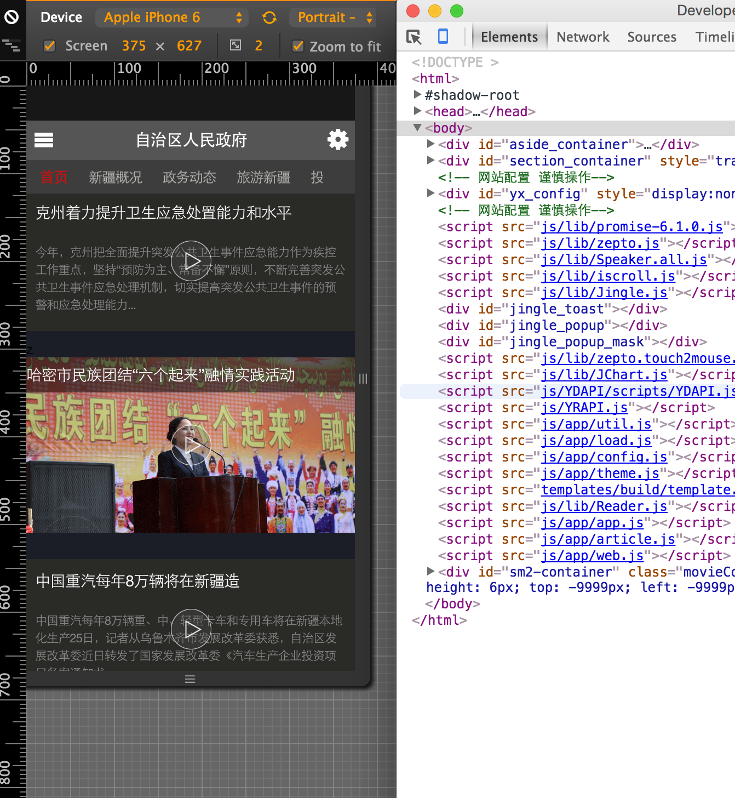

手机影院版
---------
>基于Corodva和Jingle框架开发完成的混合应用，目前移动应用只发布了Android版本。

兼容性
=====

下面的浏览器是已经经过测试的可以兼容，当然其实际支持的范围可能比下面列出的更大， 但是限于时间和资源我无法一一测试，如果您在使用过程中发现可以兼容其他浏览器欢迎告诉我，Android应用会调用自带默认浏览器，如果浏览器版本过低，请考虑为手机升级。

- Chrome ....... ✔
- UC ...............✔
- QQ .............. ✔

手机影院版的正确打开方式
====================

```
git clone https://github.com/babyshamble/mobilemedia.git

```
- 首先你可以使用android手机直接安装另一个项目中的apk/mobilemedia.apk。

- 当然你也可以通过浏览器直接打开它，将mobilemedia目录移动到您的www目录下，用谷歌浏览器访问您的www目录，直接打开mobilemedia/www/，并且把浏览模式调为手机模拟器。

- 如果一切顺利，您将看到如下页面。 
	
